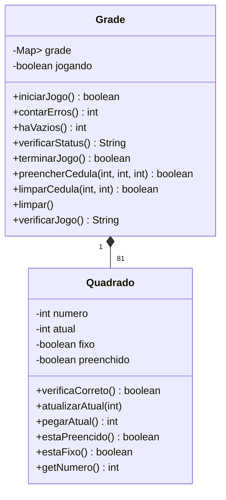

# Jogo Sudoku em Java


---

## 🎮 Visão Geral

Esse é um jogo de Sudoku desenvolvido em Java, focado em demonstrar conceitos de Programação Orientada a Objetos (POO) e estruturas de dados. O sistema oferece:

- Geração aleatória de tabuleiros válidos de Sudoku.
- Preenchimento e remoção de números com validação de regras.
- Verificação de erros em tempo real.
- Interface de linha de comando (CLI) interativa.
- Controle de estado do jogo (iniciar, limpar, finalizar).

---

## 🚀 Principais Funcionalidades

| Funcionalidade          | Descrição                                                                 |
|-------------------------|---------------------------------------------------------------------------|
| **Novo Jogo**           | Inicia um tabuleiro válido com células fixas e espaços vaziais.           |
| **Inserir Número**      | Permite inserir números de 1 a 9 em células não fixas.                    |
| **Remover Número**      | Remove números inseridos pelo usuário.                                    |
| **Verificar Tabuleiro** | Exibe o estado atual do jogo e contagem de erros/espaços vazios.          |
| **Status do Jogo**      | Mostra se o jogo está incompleto, completo ou não iniciado.               |
| **Limpar Tabuleiro**    | Remove todos os números inseridos pelo usuário, mantendo células fixas.   |

---

## 🏗️ Estrutura do Projeto

```
src/
├── entidades/
│   ├── Grade.java          # Gerencia o tabuleiro e lógica do jogo
│   └── Quadrado.java       # Representa uma célula do Sudoku (valor, fixo, etc.)
├── util/
│   └── NovoJogo.java       # Gera tabuleiros válidos e verifica repetições
└── App.java                # Classe principal com interface de texto
```

---

## 📊 Diagrama de Classes



---

## 🕹️ Como Jogar

1. **Iniciar Novo Jogo**  
   ```
   [1] Iniciar um novo jogo
   -> 1
   Jogo inicializado!
   ```

2. **Inserir Número**  
   ```
   [2] Colocar um novo número
   Informe a linha desejada: 3
   Informe a coluna desejada: 4
   Informe o número: 7
   Número 7 alocado na linha 3 e coluna 4!
   ```

3. **Verificar Tabuleiro**  
   ```
   [4] Verificar jogo
   
     | 1 | 2 | 3 | 4 | 5 | 6 | 7 | 8 | 9 | 
   ----------------------------------------
   ... (tabuleiro completo)
   ```

4. **Finalizar Jogo**  
   ```
   [7] Finalizar o jogo
   Jogo finalizado! (apenas se todas as células estiverem corretas)
   ```

---

## 🛠️ Tecnologias

- **Linguagem:** Java 8+
- **Bibliotecas:** Coleções do Java (`Map`, `List`, `Set`)
- **Ferramentas:** Compilador Java (javac) ou IDE de preferência.

---

## Funcionalidades Principais

### Grade (Tabuleiro)
- **Controle de Estado**  
  - Inicia/finaliza jogos
  - Calcula células vazias e erros
  - Verifica vitória (tabuleiro completo sem erros)

- **Manipulação de Células**  
  - Preenchimento com validação de regras
  - Limpeza segura (preserva células fixas)
  - Exibição formatada do tabuleiro

### Quadrado (Célula)
- **Propriedades Inteligentes**  
  - Armazena valor correto e valor atual
  - Identifica células fixas (pré-preenchidas)
  - Verifica se o valor atual está correto

### NovoJogo (Gerador)
- **Algoritmo de Geração**  
  - Cria tabuleiros válidos usando randomização controlada
  - Garante unicidade em linhas, colunas e blocos 3x3
  - Distribui células fixas estrategicamente

---


## Boas Práticas Implementadas

- **Encapsulamento Rigoroso**: Todos os campos protegidos com acesso controlado
- **Validação em Tempo Real**: Checagem de entradas inválidas e células fixas
- **Otimização de Memória**: Uso eficiente de estruturas Map para grid dinâmico
- **Algoritmo Eficiente**: Geração rápida de tabuleiros válidos com mix de técnicas

---

## ⚙️ Instalação e Execução

1. Clone o repositório:
   ```bash
   git clone https://github.com/seu-usuario/sudoku-java.git
   ```

2. Compile o projeto:
   ```bash
   javac -d bin src/entidades/*.java src/util/*.java src/App.java
   ```

3. Execute:
   ```bash
   java -cp bin App
   ```

---

## 🔄 Possíveis Melhorias Futuras

- Interface gráfica (GUI) com JavaFX ou Swing.
- Níveis de dificuldade (fácil, médio, difícil).
- Sistema de dicas ou resolução automática.
- Undo/Redo de jogadas.
- Salvar/Carregar progresso.

---

## 📜 Licença

Este projeto está licenciado sob a [MIT License](LICENSE).

---

## Contato

- **Autor**: Xanderson Silva  
- **Email**: xandersonsilvasouza@gmail.com  
- **LinkedIn**: [Perfil LinkedIn](https://www.linkedin.com/in/xanderson-silva)

**Contribuições são bem-vindas!** Sinta-se à vontade para abrir issues ou pull requests.

**Divirta-se resolvendo Sudokus!** 🧩